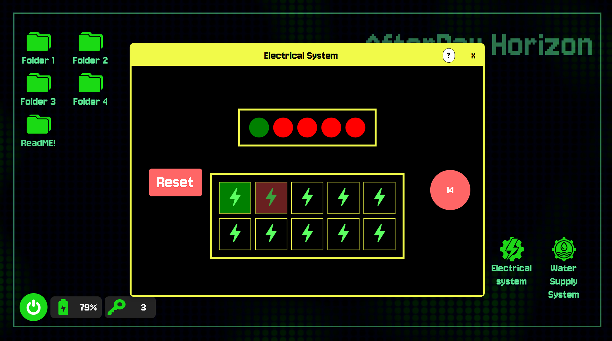

# AfterDay Horizon

### Two players. Two perspectives. One bunker to keep alive.

**AfterDay Horizon** is a cooperative survival game concept that connects a VR player with a web operator. Each player sees different information, so staying alive depends on communicating, solving problems and making decisions together.

This repository contains the **project showcase website and an interactive demo of the web operator's tools**.

[Explore the website](https://afterday-horizon.vercel.app/) · [Try the web demo](https://afterday-horizon.vercel.app/game.html?demo=1) · [View on Behance](https://www.behance.net/gallery/244161853/AfterDay-Horizon-Award-Winning-VR-Web-Co-op-Game)



## เกี่ยวกับโปรเจกต์

AfterDay Horizon คือโปรเจกต์เกมเอาชีวิตรอดแบบร่วมมือสำหรับผู้เล่นสองคน ในโลกหลังวิกฤตสภาพภูมิอากาศ ผู้เล่นต้องช่วยกันดูแลบังเกอร์ผ่านอุปกรณ์คนละแบบ โดยแต่ละฝั่งมีข้อมูลที่อีกคนมองไม่เห็น

| บทบาท | สิ่งที่ผู้เล่นทำ |
|---|---|
| **ผู้เล่น VR** | สำรวจพื้นที่ในบังเกอร์ สังเกตอุปกรณ์ และลงมือแก้ปัญหาในฉาก |
| **ผู้ดูแลผ่านเว็บไซต์** | อ่านคู่มือ ค้นหาเบาะแส ดูสถานะระบบ และสื่อสารข้อมูลให้ผู้เล่น VR |

หัวใจของเกมคือ **การสื่อสารข้อมูลให้ตรงกัน** เพื่อแก้ปัญหาระบบไฟฟ้า น้ำ และเหตุผิดปกติ ก่อนสถานะสำคัญของบังเกอร์จะหมดลง

## ใน repository นี้มีอะไรบ้าง

- **เว็บไซต์แนะนำผลงาน** — แนวคิด วิธีเล่น ระบบเกม และคลิป Showcase
- **ภาพจากทั้งสองมุมมอง** — เปรียบเทียบหน้าจอฝั่งเว็บไซต์กับสิ่งที่ผู้เล่น VR เห็น
- **เบื้องหลังการพัฒนา** — ภาพคอนเซปต้นแบบ การทดลอง และภาพผลงานที่กดขยายดูได้
- **เดโมฝั่งเว็บไซต์** — Tutorial แบบโต้ตอบ เครื่องมือระบบ คู่มือ และมินิเกม
- **ภาษาไทยและอังกฤษ** — ภาษาที่เลือกในหน้าแนะนำจะใช้ต่อในเดโม

### ขอบเขตของเดโม

**เดโมนี้ใช้ทดลองเครื่องมือฝั่งเว็บไซต์เท่านั้น ยังไม่ใช่เกมเต็มและยังไม่เชื่อมเล่นร่วมกับผู้เล่น VR** ไม่ต้องมีชุด VR ก็ทดลองหน้าเว็บไซต์ได้

เมื่อทำ Tutorial ครบหรือเลือกข้าม จะมีหน้าข้อมูลเดโมก่อนเริ่ม ต้องกด **เริ่มทดลองใช้งาน** จึงเริ่มเหตุการณ์จำลอง

หน้าแนะนำรองรับคอมพิวเตอร์และมือถือ ส่วนเดโมเครื่องมือออกแบบสำหรับ **หน้าจอคอมพิวเตอร์**

## Recognition

- **Special Prize — NAPROCK PROCON 2024**, Japan
- **CDVE 2025** — accepted for presentation and publication at Cooperative Design, Visualization and Engineering

ภาพกิจกรรมและหลักฐานผลงานอยู่ในส่วนผลงานบนเว็บไซต์

## English overview

The VR player explores the bunker and interacts with its equipment. The web operator reads guides, checks system information and shares clues. The two roles must combine what they know to respond to electrical faults, water-system problems and other threats.

The website presents the project through gameplay footage, paired Web/VR screenshots, early concepts and competition records. Its browser demo lets visitors explore the web-side interface, follow an interactive tutorial and try four minigames: image swapping, spot the difference, waste sorting and virus clicking.

**The browser demo is a standalone preview. Live cooperation with a VR player is not available here.** The presentation supports mobile viewing; the demo is intended for desktop screens. Both Thai and English are supported.

## Run locally

Built with **HTML, CSS and vanilla JavaScript**. No build step or npm installation is required.

From the repository folder, start a local HTTP server:

```powershell
py -m http.server 8011 --bind 127.0.0.1
```

Use `python` or `python3` instead of `py` if needed.

| Page | Local URL |
|---|---|
| Project website | http://127.0.0.1:8011/ |
| Tutorial and demo | http://127.0.0.1:8011/game.html?demo=1 |

Use HTTP rather than opening the HTML file directly: the demo loads `seed.json` through `fetch()`.

## Project structure

```text
index.html             Project showcase website
game.html              Web operator demo
presentation.js        Presentation interactions
i18n.js                Presentation translations
game-language.js       Game translations
tutorial.js            Interactive onboarding
script.js              Game windows and session flow
minigame.js            Four browser minigames
seed.json              Demo data
img_new/               Presentation images and showcase video
HANDOFF.md             Developer handoff and testing notes
```

Additional stylesheets and asset folders support the game systems, manuals and galleries. The showcase video is `img_new/cdve/showcase.mp4`.

## Deployment

This is a static website. For Vercel, use:

| Setting | Value |
|---|---|
| Framework Preset | Other |
| Root Directory | Folder containing `index.html`, `game.html` and `seed.json` |
| Build Command | Override with an empty value |
| Install Command | Override with an empty value |
| Output Directory | `.` |

Verify the deployed commit and test both the project page and demo after publishing.

## Continuing development

อ่าน **[HANDOFF.md](HANDOFF.md)** ก่อนทำงานต่อ เพื่อดูโฟลเดอร์ที่ใช้งานล่าสุด โครงสร้างระบบ สิ่งที่แก้แล้ว ผลการทดสอบ และข้อควรตรวจเพิ่มเติม
